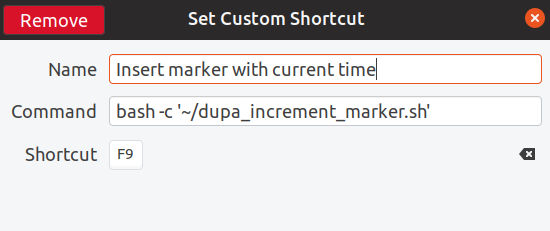

# dupa_increment_count
Simple debug marker you can have inserted anywhere just by binding this script to a keypress. The counter resets once your `/tmp/increment_marker.dupa` is removed (so, practically on every system boot). 

Then, it will insert an unique marker with current time every time you press the key:
```
dupa_1 at 00:36:26
dupa_2 at 00:36:28
```

Or, given that you just typed:
```
console.log('<your cursor here>')
```
...press the assigned key, aaand...
```
console.log('dupa_3 at 00:41:29')
```


# Dependencies
[xvkbd](http://t-sato.in.coocan.jp/xvkbd/)

# Installation
1. `$ git clone git@github.com:pawelduda/dupa_increment_count.git`
2. `$ chmod +x dupa_increment_count/dupa_increment_marker.sh`
3. Bind a key to the command, like so:


